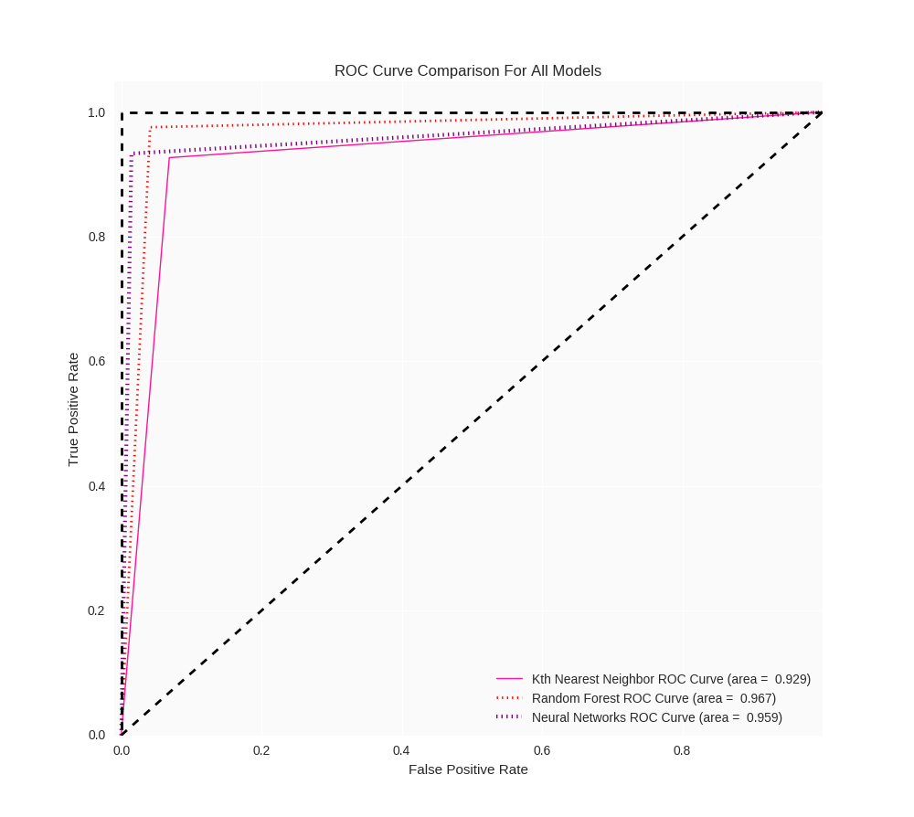

# Machine Learning Techniques on Breast Cancer Wisconsin Data Set

**Contributor**:
+ Raul Eulogio

I created this repo as a way to get better acquainted with **Python** (Specifically 3.5.2) as a language and as a tool for data analysis. But it eventually became in exercise in utilizing various programming languages for machine learning applications. 

I employed four **Machine Learning** techniques:
+ **Kth Nearest Neighbor**
+ **Random Forest**
+ **Neural Networks**

If you would like to see a walk through of the analysis on [inertia7](https://www.inertia7.com/projects/3) includes running code as well as explanations for algorithms and processes. 

The repository includes the *scripts* folder which contains scripts for these programming languages (in order of most detailed):
+ *Python*
+ *R*
+ *PySpark*

This repo is primarily concerned with the *python* iteration. 

The multiple *python* script is broken into 5 sections (done by creating a scipt for each section) in the following order:
+ **Exploratory Analysis**
+ **Kth Nearest Neighbors**
+ **Random Forest**
+ **Neural Networks**
+ **Comparing Models**

**NOTE**: The `helper_functions.py` script automates a lot of the processes and is used heavily in the other scripts. So if you want to see how my user made functions work, definitely check it out.  

## Running .py Script
It goes without saying that a `virtualenv` is needed where you will download the necessary packages from the `requirements.txt` using:

	pip3 install -r requirements.txt

Once this is done you can run the scripts using the usual terminal command:

	$ python3 exploratory_analysis.py

**NOTE**: You can also run it by making script executable as such:

	$ chmod +x exploratory_analysis.py

**Remember**: You must have a *shebang* for this to run i.e. this must be at the very beginning of your script:

	#!/usr/bin/env python3

then you would simply just run it (I'll use **Random Forest** as an example)

	$ ./random_forest.py

## Conclusions
Once I employed all these methods, we can get a better feel for the data. Each model provided useful features that are useful in real world applications. *Random forest* helps us see what variables were the most important when predicting the diagnoses, which is useful to help researchers know what variables are important and ultimately feature engineering. *Kth Nearest Neighbor* provides the best predictive power in terms of *cross validation*, which is our strongest metric when evaluating models. And *Neural Networks* provides the least false negatives which is important in this respective case study since a false negative can result in *death*.  

### Diagnostics for Data Set

| Model/Algorithm      | Test Error Rate | False Negative for Test Set | Area under the Curve for ROC | Cross Validation Score        | Hyperparameter Optimization | 
|----------------------|-----------------|-----------------------------|------------------------------|-------------------------------|-----------------------|
| Kth Nearest Neighbor | 0.07  | 5 | 0.929 | Accuracy:  0.925 (+/-  0.025) | Optimal *K* is 3 | 
| Random Forest        | 0.035 | 3 | 0.967 | Accuracy:  0.963 (+/-  0.013) | {'bootstrap': True, 'criterion': 'entropy', 'max_depth': 4}	|
| Neural Networks      | 0.035 | 1 | 0.959 | Accuracy:  0.967 (+/-  0.011) | {'hidden_layer_sizes': 12, 'activation': 'tanh', 'learning_rate_init': 0.05} | 

#### ROC Curves for Data Set

#### ROC Curves zoomed in

The ROC Curves are more telling of **Random Forest** being a better model for predicting. 

Any feedback is welcomed!

Things to do:
+ Create new **Jupter Notebook** to reflect changes made since newest iteration (7/14/2017)
+ Add unit testing if appropriate after research 
+ Update inertia7 project
+ More detailed conclusion 
