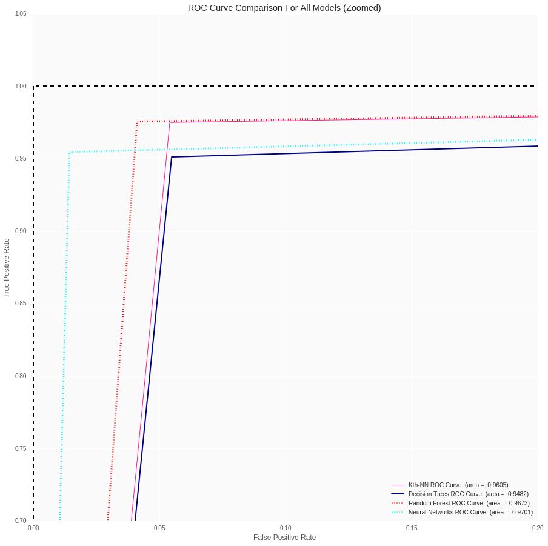

# Machine Learning Techniques on Breast Cancer Wisconsin Data Set

**Contributor**:
+ Raul Eulogio

I created this repo as a way to get better acquainted with **Python** as a language and as a tool for data analysis. 

I employed four **Machine Learning** techniques:
+ **Kth Nearest Neighbor**
+ **Random Forest**
+ **Neural Networks**

If you would like to see a walk through of the analysis the **Jupyter Notebook** includes running code as well as explanations for algorithms and processes. 

For the script I employed a technique I learned from [Nathan Fritter](https://github.com/Njfritter) (thanks homie). It is outlined as such:

The **.py** script is broken into 4 sections (done by creating a function for each section) in the following order:
+ **Exploratory Analysis**
+ **Kth Nearest Neighbors**
+ **Random Forest**
+ **Neural Networks**

## Running .py Script

To run the script successfully, within the terminal you would employ this technique (Outlined starting at line 618):

I have 5 functions which are called up using these initials:
+ **Exploratory Analysis** - `EA`
+ **Kth Nearest Neighbors** - `KNN`
+ **Random Forest** - `RF`
+ **Neural Networks** - `NN`
+ **Compare Models** - `CM`

So for example you wanted to run **Exploratory Analysis** section you type this into the terminal:

	$ python breastCancerWisconsinDataSet_MachineLearning.py EA

You would do the same for all other functions with the respective initial!

**NOTE**: You can also run it by making script executable as such:

	$ chmod +x breastCancerWisconsinDataSet_MachineLearning.py

**Remember**: You must have a *shebang* for this to run i.e. this must be at the very beginning of your script:

	#!/usr/bin/env python3

then you would simply just run it (I'll use **Random Forest** as an example)

	$ ./breastCancerWisconsinDataSet_MachineLearning.py RF

## Conclusions
Once I employed all these methods, we can that **Neural Networks** performed the best in terms of most diagnostics. *Kth Nearest Neighbor* performed better in terms of *cross validation*, but I have yet to perform *hyperparameter optimization* on other processes.  This project is an iterative process, so I will be working to reach a final consensus. In terms of most insight into the data, *random forest* model is able to tell us the most of our model. In terms of cross validated performance *kth nearest neighbor* performed the best.  

### Diagnostics for Data Set

| Model/Algorithm 	| Test Error Rate 	| False Negative for Test Set 	| Area under the Curve for ROC | Cross Validation Score | Hyperparameter Optimization | 
|-----------------|-----------------|-------------------------------|----------------------------|-----------|------|
| Kth Nearest Neighbor | 0.035 |	2 |	0.963 | 0.966 (+/-  0.021) | Optimal **k** = 9 |
| Random Forest 	|  0.035	| 3 	| 0.9673 |  0.955 (+/-  0.022) |  {'bootstrap': True, 'criterion': 'entropy', 'max_depth': 4} | 
| Neural Networks 	| 0.035 	| 1 	| 0.952 |  0.947 (+/-  0.030) |  {'hidden_layer_sizes': 12, 'activation': 'tanh', 'learning_rate_init': 0.05} | 

#### ROC Curves for Data Set
**NOTE**: Created on the **Jupyter Notebook** iteration. Not found in **Python** script. 

#### ROC Curves zoomed in

The ROC Curves are more telling of **Random Forest** being a better model for predicting. 

Any feedback is welcomed!

Things to do:
+ Change **Jupter Notebook** to reflect changes made when doing *Hyperparameter Optimization*
+ Change conclusions since reading documentation of real life application showed that both **Neural Networks** and **Random Forest** are useful. Its not just about picking one model. Found here: https://research.googleblog.com/2017/03/assisting-pathologists-in-detecting.html