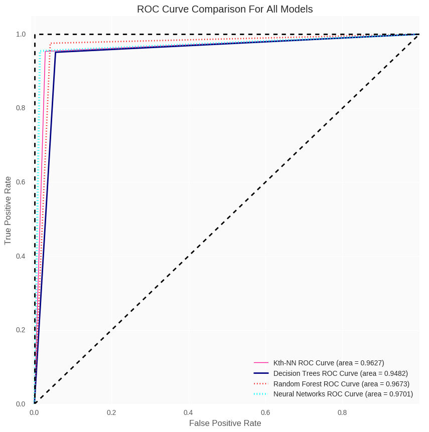

# Machine Learning Techniques on Breast Cancer Wisconsin Data Set

**Contributor**:
+ Raul Eulogio

I created this repo as a way to get better acquainted with **Python** as a language and as a tool for data analysis. 

I employed four **Machine Learning** techniques:
+ **Kth Nearest Neighbor**
+ **Decision Tree**
+ **Random Forest**
+ **Neural Networks**

If you would like to see a walk through of the analysis the jupyter notebook includes running code as well as explanations for algorithms and processes. 

For the script I employed a technique I learned from [Nathan Fritter](https://github.com/Njfritter) (thanks homie). It is outlined as such:

The **.py** script is broken into 5 sections (done by creating a function for each section) in the following order:
+ **Exploratory Analysis**
+ **Visual Exploratory Analysis**
+ **Kth Nearest Neighbors**
+ **Decision Tree**
+ **Random Forest**
+ **Neural Networks**

## Running .py Script

To run the script successfully, within the terminal you would employ this technique (Outlined starting at line 618):

I have 6 functions which are called up using these initials:
+ **Exploratory Analysis** - `EA`
+ **Visual Exploratory Analysis** - `VEA`
+ **Kth Nearest Neighbors** - `KNN`
+ **Decision Tree** - `DT`
+ **Random Forest** - `RF`
+ **Neural Networks** - `NN`

So for example you wanted to run **Exploratory Analysis** section you type this into the terminal:

	$ python breastCancerWisconsinDataSet_MachineLearning.py EA

You would do the same for all other functions with the respective initial!

**NOTE**: You can also run it by making script executable as such:

	$ chmod +x breastCancerWisconsinDataSet_MachineLearning.py

then you would simply just run it (I'll use **Random Forest** as an example)

	$ ./breastCancerWisconsinDataSet_MachineLearning.py RF

## Conclusions
Once I employed all these methods I deduced that **Neural Networks** performed the best in terms of all diagnostics. But when choosing the best model since **Neural Networks** are *black box* models, we don't gain a lot of insight into our data. So in conclusion **Random Forest** was the best model in terms of performance and insight to our data. 

### Diagnostics for Data Set

| Model/Algorithm 	| Test Error Rate 	| False Negative for Test Set 	| Area under the Curve for ROC | 
|-----------------|-----------------|-------------------------------|----------------------------|
| Kth Nearest Neighbor 	| 3.509% |	2 |	0.9627 | 
| Decision Trees 	| 5.263% 	| 4 |	0.9482 | 
| Random Forest 	| 3.509% 	| 3 	| 0.9673 | 
| Neural Networks 	| 2.632% 	| 1 	| 0.9701 | 

#### ROC Curve for Script

If you can figure out why values are different for script and notebook please let me know!

Any feedback is welcomed!

Things to do:
+ drink beer  

Still a work in progress, but decided to leave both iterations to show different ways my work flow happens and emphasize that iterations make a project go from **okay** to **lit af** 